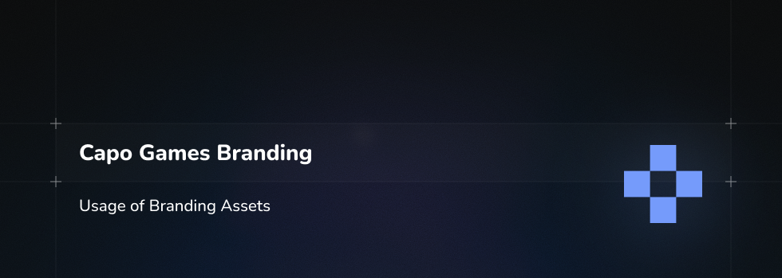
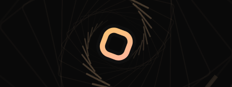

# Branding

This repository contains official branding assets for use with the **Rhythia** product line and this organization’s public presence.

> **Note:** These materials are **not open source**. They are provided for limited, primarily non-commercial and internal use only. Please read the usage guidelines below before using any asset.

The purpose of this document is to strive for a certain level of quality when representing the brand and the game.

Only the presented images are subject to the given branding, any other variants, colors, or different images have nothing to do with our products!

---

## 1. Contents

### 1.1 Logos

- **Logo Color**  
  Primary full-color horizontal logo. Recommended for use on light or neutral backgrounds in product pages, presentations, and external communications.

  

- **Logo Neutral**  
  Single-color / neutral variant of the horizontal logo. Suitable for use on busy backgrounds, monochrome layouts, or where color is restricted.

  

- **Square Logo Color**  
  Square/cropped version of the full-color logo. Ideal for avatars, profile images, social icons, and favicons where a compact format is required.

  

- **Square Logo Neutral**  
  Neutral (single-color) square logo for use in constrained, low-color or high-contrast environments.

  

---

### 1.2 Rhythia Product & Steam Assets

- **Rhythia Steam Banner**  
  Banner artwork optimized for use on platform pages (e.g. Steam-style storefronts) and similar distribution platforms.

  

- **Rhythia Product Banner**  
  General product marketing banner for websites, store pages, and promotional content.

  

- **Rhythia Product Banner Discrete**  
  A more minimal / low-key banner variant, suitable for subtle placement in documentation, partner pages, or smaller embeds.

  

- **Rhythia Icon**  
  Application / shortcut icon representation of Rhythia. Typically used for app icons, launchers, or small square imagery.

  

- **Rhythia Organization Codebase Icon**  
  Icon intended to represent the Rhythia-related codebases and organization across developer tools (e.g. GitHub org icon, project icons, etc.).

  

---

## 2. Usage & Licensing

Unless a different license is explicitly provided in this repository:

- All assets in this repository are provided under a **non-commercial, restricted-use license**.
- These materials are intended for:
  - Internal use within the organization
  - Editorial / press coverage of the organization or Rhythia
  - Non-commercial community content that accurately represents the brand

If you are unsure whether your use is permitted, please assume it is **not allowed** until you have obtained written permission.

---

## 3. Non-Commercial Use

You **may**:

- Use the assets in non-commercial presentations, talks, blog posts, or educational material where Rhythia or this organization is being discussed.
- Use the icons and logos to reference Rhythia in open source documentation, integration guides, or compatibility lists, as long as usage is factual and not misleading.

You **may not**, without explicit written permission:

- Use any logo, icon, or banner in or for a **commercial product, service, or paid promotion**.
- Sell, resell, or include these assets in templates, themes, design packs, or any similar redistributed package.
- Use the branding in a way that implies partnership, sponsorship, or endorsement by this organization when no such relationship exists.

---

## 4. Prohibited Uses (Legal Notice)

The assets in this repository are **proprietary**. That means:

- You are **not** granted the right to redistribute, relicense, or sub-license these assets.
- You may **not**:
  - Rebrand them
  - Modify them for re-distribution
  - Use them as the primary branding of another product, organization, or service
- Any unauthorized copying, modification, or distribution of these assets may violate applicable copyright, trademark, and unfair competition laws.

Where applicable, trademarks, logos, and names remain the exclusive property of this organization and/or its licensors.

---

## 5. Relationship to Organization-Wide Policies

- Open source **code** projects within this organization may be licensed under **GNU Affero** or similar open source licenses.
- This **Branding** repository, however, contains **design and brand assets**, not open source code, and is **not** licensed under AGPL or similar open source licenses.
- All assets here are covered by the **non-commercial, proprietary** terms described in this document and any accompanying license file.

In the event of any conflict between this README and a dedicated `LICENSE` file in the repository, the terms of the `LICENSE` file will prevail.

---

## 6. Attribution & Presentation

When using these assets in an allowed context:

- Do not stretch, deform, or recolor the logos in ways that conflict with the provided variants.
- Maintain adequate clear space around the logos and icons so they remain legible and distinct.
- Do not overlay busy patterns or text on top of the logo unless specifically designed to do so.
- When creating a tool, or any other affiliated software for our products, please mark them as "X for Rhythia" not "Rhythia X" (for eg. "Editor for Rhythia", not "Rhythia Editor")

When in doubt, default to:

> Use the **Logo Color** or **Logo Neutral** on clean backgrounds, with clear space, and without additional effects that obscure visibility.

Please do not skew or round the corners, use assets as as.

---

## 7. Requests & Questions

If you would like to:

- Use these assets in a commercial project
- Obtain a special license or extended rights
- Ask about a specific use-case not clearly covered above

please contact the organization through the channels listed on the GitHub organization profile or the main website, and provide:

- A short description of your project
- How and where you intend to use the assets
- Whether the use is commercial or non-commercial

We’ll review your request and get back to you as appropriate.

---

Thank you for respecting these branding guidelines and helping us keep a consistent, clear identity for Rhythia and this organization.
